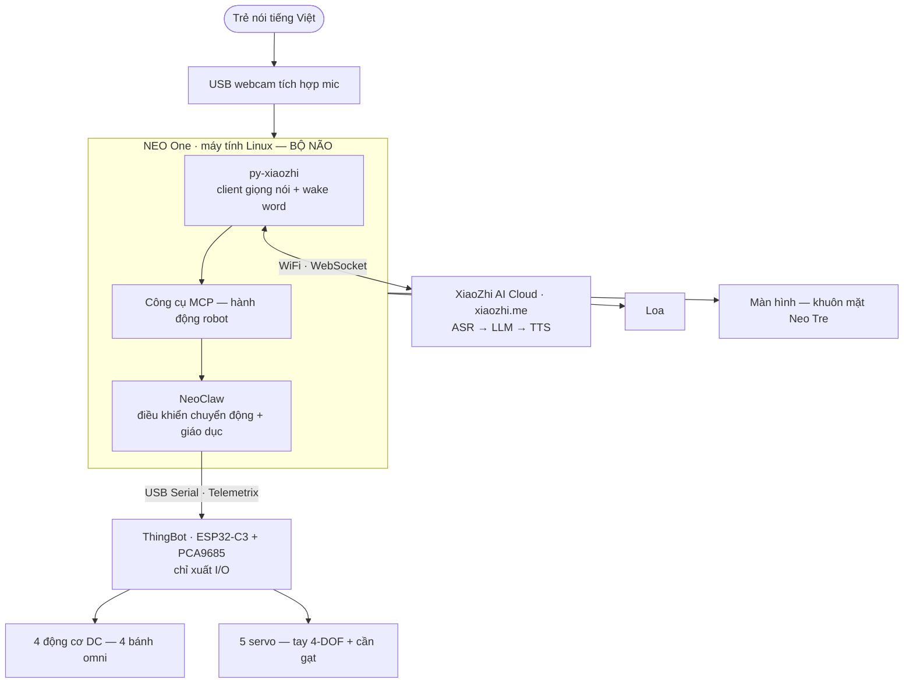

# NeoClaw — Bản NEO One
### Robot 4 bánh đa hướng & tay gắp điều khiển bằng giọng nói
**Mô tả sản phẩm & Kiến trúc kỹ thuật — Dev brief**

> Tài liệu phục vụ phát triển (dùng làm ngữ cảnh cho Claude Code).
> Phiên bản 2.1 · 2026-05-18 · Maker Việt × ThingEdu

**Status**: 🎯 **Đường chính** — đây là kiến trúc được ưu tiên phát triển. Bản voice-cloud trực tiếp trên ESP32 (`tuanln/thingvui`) **đã PAUSED từ 2026-05-18** để tập trung làm bản này chạy ổn định trước.

---

## Tóm tắt

NeoClaw là **robot mẫu** cho hệ thống Làng Maker @ FPT Shop: robot di động 4 bánh đa hướng kèm tay gắp 4 bậc tự do, **điều khiển bằng giọng nói tiếng Việt**. Sản phẩm vừa là robot trình diễn tại các làng, vừa được đóng gói thành **bộ kit** bán cho trường học và phụ huynh.

Bản này đặt **bộ não trên NEO One** — máy tính nhúng Linux Made-in-Vietnam của ThingEdu. NEO One chạy đồng thời hai phần mềm mã nguồn mở: **py-xiaozhi** (client giọng nói Xiaozhi) và **NeoClaw** (điều khiển chuyển động + giáo dục). Mạch ThingBot (ESP32) lùi về đúng vai trò của nó: **chỉ xuất tín hiệu động cơ/servo**.

**Phạm vi cần xây dựng** ở Phần 9. **Câu hỏi mở cần dev xác nhận** ở Phần 10. **Lộ trình triển khai cụ thể** ở Phần 11.

---

## 1. Thay đổi kiến trúc & lý do

Bản trước đặt firmware giọng nói Xiaozhi chạy thẳng trên mạch ThingBot (ESP32-C3). Cách này có rủi ro thật:

- **ESP32-C3 quá yếu cho việc gánh Xiaozhi.** Chip 1 nhân, không gắn được PSRAM — đủ chạy firmware gốc nhưng nhồi thêm tính năng là hết RAM. Cộng đồng maker đã xác nhận bằng thực nghiệm.
- **ESP32-S3 chạy được**, nhưng mảng firmware S3 đang rất đông người làm — không phải lợi thế cạnh tranh.

Hướng đi đúng: **đừng bắt vi điều khiển gánh trí tuệ.** Cho một máy tính thật làm bộ não. Cộng đồng maker dùng Android Box; chúng ta có sẵn **NEO One chạy Linux** — và Xiaozhi có client Linux chính thức.

Kết quả — kiến trúc mới gọn và mạnh hơn hẳn:

| | Bản trước (ThingVui standalone) | **Bản NEO One (tài liệu này)** |
|---|---|---|
| Bộ não | Firmware Xiaozhi trên ESP32 | NEO One (Linux) chạy py-xiaozhi + NeoClaw |
| Vai trò ThingBot | Vừa giọng nói vừa chuyển động | **Chỉ xuất I/O động cơ/servo** |
| Rủi ro C3/S3 | Phải chọn chip, dễ "tạch" | Không còn — ESP32 chỉ làm I/O |
| Lớp dạy Python | Phải đợi bản sau | Có ngay từ đầu (NeoClaw chạy trên NEO One) |
| Trạng thái | ⏸ PAUSED ở `tuanln/thingvui` (2026-05-18) | 🎯 Đường chính, đang triển khai |

Đây cũng chính là kiến trúc gốc trong tài liệu CLAWBOT-SETUP-GUIDE của NeoClaw: NEO One là bộ não, ThingBot là I/O, nối nhau qua USB Serial.

> **Online → Offline là hai *chế độ*, không phải hai *bản phần cứng*.** Cùng một robot: ban đầu chạy trực tuyến qua đám mây xiaozhi.me, về sau chuyển sang ngoại tuyến — chỉ đổi cấu hình, không đổi phần cứng (xem Phần 6). Mạch ThingVoi chuyên dụng trở thành **tùy chọn tương lai**, không nằm trên đường tới đích.

---

## 2. Người dùng & trải nghiệm cốt lõi

- **Trẻ 6–15 tuổi tại Làng Maker** — nói tiếng Việt để ra lệnh cho robot, rồi học lập trình Python để điều khiển robot.
- **Thợ Cả tại Làng Maker** — dùng robot làm tâm điểm Showcase Wall.
- **Trường học / phụ huynh mua kit** — robot trình diễn kiêm nền tảng học STEM.

Bé nói *"đi tiến"*, *"sang trái"*, *"gắp khối gỗ"*, *"thả ra"* — robot lắng nghe, trả lời bằng giọng nói, và thực hiện. Khuôn mặt biểu cảm trên màn hình là **Neo Tre** — người bạn AI của dự án, nay có một cơ thể.

---

## 3. Thành phần phần cứng

| Nhóm | Linh kiện | Ghi chú |
|---|---|---|
| **Bộ não** | **NEO One** — máy tính nhúng Linux | Sản phẩm ThingEdu; **đề xuất ≥ 2GB RAM** (1GB chạy được nhưng đầy chật, py-xiaozhi với Sherpa-ONNX wake word ăn ~400–600MB, NeoClaw ~100–200MB; cần đệm cho mô hình lớn hơn ở chế độ ngoại tuyến) |
| Điều khiển I/O | Mạch **ThingBot** — ESP32-C3 + PCA9685 (PWM 16 kênh) | Sản phẩm ThingEdu; **không thay đổi**. Firmware: `tuanln/thingbot-telemetrix-arduino` |
| Đế di động | 4 bánh omni/mecanum + 4 động cơ DC | Đi mọi hướng + xoay 360° |
| Tay gắp | Khung 4-DOF + 4 servo: S1 đế, S2 vai, S3 khuỷu, S4 kẹp | Gắp / mang / thả |
| Cần gạt | 1 servo (S5) | Đẩy vật thể |
| Âm thanh & hình ảnh vào | **USB webcam có tích hợp mic** | Một linh kiện cho cả thu âm + camera (phục vụ thị giác sau này) |
| Âm thanh ra | Loa (USB hoặc 3.5mm) | — |
| Hiển thị | Màn hình nhỏ cho khuôn mặt Neo Tre | HDMI hoặc MIPI |
| Nguồn & kết nối | Pin/cục sạc; cáp USB-C NEO One ↔ ThingBot | Động cơ cần nguồn riêng 7–12V — không cấp từ 5V |

Công thức phần cứng này giống hệt cách cộng đồng maker dựng robot AI từ Android Box (box + motor + màn hình + pin + loa + webcam-mic) — chỉ khác: nền tảng là **NEO One / Linux**, và phần chuyển động dùng **ThingBot + tay gắp 4-DOF**.

---

## 4. Ngăn xếp mã nguồn mở

| Thành phần | Repo / Nền tảng | Giấy phép | Vai trò |
|---|---|---|---|
| py-xiaozhi | `github.com/huangjunsen0406/py-xiaozhi` | MIT | Client giọng nói Xiaozhi chạy trên NEO One (Linux) |
| xiaozhi-linux (thay thế) | `github.com/100askTeam/xiaozhi-linux` | Mã mở | Client Linux của 100ask — phương án dự phòng |
| XiaoZhi AI Cloud | `xiaozhi.me` (gói Open Source) | Dịch vụ | ASR + LLM + TTS, console cấu hình tác tử |
| NeoClaw | `github.com/tuanln/NeoClaw` | MIT | Điều khiển chuyển động (omni, tay) + lớp giáo dục. Tình trạng 2026-05-18: 7 module, 33 test (chạy được trong simulator), pyproject.toml + ruff. Chưa CI. |
| ThingBot firmware | `github.com/tuanln/thingbot-telemetrix-arduino` | MIT | Firmware Telemetrix trên mạch ThingBot. Tình trạng 2026-05-18: last push 2026-02-08 — sẽ refresh ở Milestone B. |
| thingbot-telemetrix | `pip install thingbot-telemetrix` | Mã mở | Thư viện Python cầu nối Serial NEO One ↔ ThingBot |
| **`tuanln/thingvui`** (paused) | — | MIT | Phần code C++ PCA9685 driver + host tests (6/6 PASS) giữ làm tham chiếu, sẽ tái dùng khi quay lại bản voice trực tiếp trên ESP32. |

**Quyết định giữ nguyên:** dùng **đám mây ngoài xiaozhi.me** (gói Open Source miễn phí), chưa tự host ở chế độ trực tuyến. py-xiaozhi mặc định kết nối hạ tầng Xiaozhi này.

---

## 5. Kiến trúc

NEO One là bộ não duy nhất, chạy song song hai phần mềm. ThingBot chỉ là cánh tay nối dài về phần điện.



**Cầu nối py-xiaozhi ↔ NeoClaw:** các công cụ MCP trong py-xiaozhi gọi API điều khiển của NeoClaw — `ClawRobot` (import trực tiếp dưới dạng thư viện Python, hoặc qua một dịch vụ cục bộ nhỏ). Cả hai đều là Python, cùng chạy trên NEO One.

**Luồng một lệnh** — bé nói *"gắp khối gỗ"*:
1. USB mic thu âm → NEO One.
2. py-xiaozhi: phát hiện wake word (offline), stream âm thanh lên xiaozhi.me.
3. Đám mây: ASR ra văn bản → LLM hiểu ý định, gọi công cụ MCP `pick_up`.
4. Công cụ MCP trên NEO One → gọi `ClawRobot.pick_up()` của NeoClaw → gửi lệnh xuống ThingBot qua USB Serial.
5. ThingBot xuất PWM qua PCA9685 → servo tay gắp thao tác.
6. LLM trả lời bằng giọng nói → loa; khuôn mặt Neo Tre đổi biểu cảm trên màn hình.

---

## 6. Hai chế độ vận hành

Cùng một phần cứng, khác nhau ở việc trí tuệ đặt ở đâu.

| | **Chế độ Trực tuyến** (giai đoạn đầu) | **Chế độ Ngoại tuyến** (giai đoạn sau) |
|---|---|---|
| ASR / LLM / TTS | Đám mây xiaozhi.me | Máy chủ Xiaozhi tự host / mô hình cục bộ trên NEO One |
| Internet | Cần | Không cần |
| Cách chuyển đổi | — | **Chỉ đổi cấu hình endpoint của py-xiaozhi** — không đổi phần cứng |
| Ưu điểm | Ra mắt nhanh, mô hình mạnh, miễn phí | Chạy ở vùng không mạng; dữ liệu giọng trẻ ở lại thiết bị |

Đây là phần "ứng vạn biến": phần cứng (NEO One + ThingBot) bất biến, lớp mô hình thay đổi theo điều kiện.

---

## 7. Bề mặt hành động — danh mục công cụ MCP

py-xiaozhi cần expose các công cụ MCP sau, mỗi công cụ ánh xạ 1–1 tới một hàm của NeoClaw `ClawRobot` (tham khảo `omni_base.py`, `robot_arm.py`, `claw_robot.py`). Mỗi công cụ kèm **mô tả tiếng Việt** để LLM hiểu đúng.

**Di chuyển — đế omni**
```
move_forward / move_backward      (speed, duration)
strafe_left / strafe_right        (đi ngang)
turn_left / turn_right            (xoay tại chỗ)
diagonal_forward_left/right ...    (đi chéo)
stop / emergency_stop
```

**Tay gắp & cần gạt**
```
arm_home                          (về vị trí giữa)
arm_pose                          (reach_forward | reach_down | carry | rest)
arm_grip / arm_release            (đóng / mở kẹp)
arm_set_joint                     (base | shoulder | elbow | gripper, góc)
sweep / set_sweeper               (gạt 1 lần / đặt góc cần gạt)
```

**Hành động kết hợp**
```
pick_up                           (hạ tay → gắp → nâng)
put_down                          (hạ tay → thả)
```

**Phản hồi**
```
beep / set_led
```

Ví dụ ánh xạ ngôn ngữ tự nhiên: *"lùi lại 2 giây"* → `move_backward(duration=2)`; *"hạ tay xuống rồi gắp"* → `arm_pose("reach_down")` + `arm_grip`.

Catalog đầy đủ 25+ tool có description tiếng Việt + code skeleton: xem `tuanln/thingvui/docs/mcp-tool-catalog.md` (paused repo, nội dung này tái dùng được vì semantic không phụ thuộc ESP32 hay NEO One).

---

## 8. Tích hợp giáo dục tại Làng Maker

Vì NEO One chạy cả NeoClaw, robot phục vụ trọn hành trình 5 bước **ngay trên một thiết bị**:

- **Bước 1–2 (Khám phá, Hình học Rùa):** trẻ điều khiển robot bằng giọng nói qua Xiaozhi — không cần biết code.
- **Bước 3–4 (Lập trình, Kiến tạo):** trẻ viết Python trong sandbox an toàn của NeoClaw; có sẵn 6 bài học, AI Tutor gợi ý 4 cấp độ, và trình mô phỏng (học được khi chưa có robot thật).
- **Bước 5 (Chia sẻ):** học sinh lớn dùng robot hướng dẫn lại các em nhỏ.

Tay gắp + cần gạt biến robot thành thiết bị thi đấu cho sân chơi **Robot Sport** (gắp vật, xếp khối, đua nhặt đồ).

---

## 9. Phạm vi cần xây dựng

Tham chiếu plan 3 milestone (5 ngày dev) tại `NeoClaw/docs/PLAN-C3-NEOONE-2026-05-18.md`. Tóm tắt:

1. **Foundation (Milestone A — 1 ngày)** — venv Python, chạy được `pytest` baseline, GitHub Actions CI tự lint + test, pre-commit hook.
2. **Dựng NEO One làm bộ não (Milestone B1)** — cài py-xiaozhi trên Linux/ARM của NEO One; cấu hình audio (USB webcam-mic vào, loa ra); kết nối xiaozhi.me.
3. **Refresh + refactor ThingBot firmware (Milestone B1–B2)** — pull `thingbot-telemetrix-arduino` (last push 02/2026), update lib Adafruit PWM Servo Driver, build lại PlatformIO, di chuyển 4 hàm ThingBot-specific từ `src/main.cpp` (15KB) sang lib `lib/ThingBotTelemetrixArduino/` (hiện stub trống 38 byte).
4. **Cài NeoClaw trên NEO One** — `pip install -e .[hardware]`; nạp firmware Telemetrix cho ThingBot; kiểm tra kết nối Serial NEO One ↔ ThingBot; chạy thử `ClawRobot`.
5. **Integration smoke test (Milestone B3)** — `tests/test_hardware/test_telemetrix_integration.py` với marker `@pytest.mark.hardware`, gated bằng env var `THINGBOT_PORT`. Sequence: connect → digital_write LED → analog_write motor → servo center → disconnect.
6. **Lớp cầu nối MCP** — định nghĩa các công cụ MCP ở Phần 7 trong py-xiaozhi; mỗi công cụ gọi hàm tương ứng của NeoClaw `ClawRobot`.
7. **Cấu hình tác tử trên xiaozhi.me** — đăng ký thiết bị; tạo persona **"Neo Tre"** (system prompt tiếng Việt, thân thiện, cho trẻ em); bật MCP; chọn ngôn ngữ.
8. **Khuôn mặt Neo Tre** — dùng giao diện biểu cảm của py-xiaozhi, hoặc một tiến trình hiển thị "mắt robot" riêng nhẹ.
9. **An toàn (Milestone C1)** — bật module an toàn của NeoClaw (giới hạn góc servo, watchdog, `emergency_stop`); audit thread safety trong `TelemetrixBackend._pin_values`, `SensorManager._callbacks`, `SafetyWatchdog._state` — thêm `threading.Lock` ở chỗ shared mutable state.
10. **Unit test logic (Milestone C2)** — `test_omni_kinematics.py` cho mecanum (6 case kinh điển: forward, backward, strafe L/R, rotate CW/CCW); `test_robot_arm.py` cho `JOINT_LIMITS`, `ARM_POSES`, smooth motion step count.
11. **End-to-end demo (Milestone C3)** — `examples/demo_pick_drop.py`: connect → home arm → forward 1s → pick_up → strafe_left 1s → put_down → home. Chạy với simulator, sau đó hardware. Cùng script, switch backend qua env var.
12. **Tài liệu lắp ráp & đấu nối** cho Thợ Cả và người dựng kit — cập nhật `NeoClaw/docs/CLAWBOT-SETUP-GUIDE.md` thêm section "5-phút bắt đầu với ThingBot thật".

---

## 10. Câu hỏi mở & rủi ro kỹ thuật

| Vấn đề | Nội dung cần xác nhận | Cập nhật 2026-05-18 |
|---|---|---|
| **Cấu hình NEO One** | Xác nhận RAM ≥ 1GB và CPU đủ chạy py-xiaozhi (wake word Sherpa-ONNX) + NeoClaw đồng thời. Dùng chế độ CLI/headless của py-xiaozhi cho nhẹ; khuôn mặt tách thành tiến trình riêng. | Đề xuất nâng yêu cầu lên ≥ 2GB RAM (xem §3). |
| **py-xiaozhi trên ARM** | Kiểm tra các thư viện (PyAudio, sherpa-onnx, opus, PyQt nếu dùng GUI) có sẵn bản cho kiến trúc ARM của NEO One — có thể phải tự build. | Chưa kiểm — nằm trong Milestone B1. |
| **Công cụ MCP tùy biến** | Xác nhận py-xiaozhi cho phép đăng ký công cụ MCP riêng để gắn hành động robot (theo mô tả, py-xiaozhi có sẵn hệ công cụ MCP). | Chưa kiểm. |
| **Tiếng Việt** | Xác nhận ASR của xiaozhi.me nhận diện tốt giọng trẻ em nói tiếng Việt. | Cần test với 5 trẻ thật trước pilot. |
| **Độ trễ** | Chuỗi giọng nói → đám mây → MCP → Serial → động cơ có độ trễ; đo thực tế, chấp nhận được cho demo. | Chưa đo. |
| **Phụ thuộc internet** | Chế độ trực tuyến cần mạng — chuẩn bị kịch bản offline cho Thợ Cả khi mất kết nối; chế độ ngoại tuyến giải quyết triệt để. | OK. |
| **🆕 TelemetrixBackend chưa từng test với mạch thật** | Tất cả 33 test trong NeoClaw đều dùng SimulatorBackend. Chưa biết Serial / baud / timeout có lỗi gì khi tải thật. | Milestone B3 xử lý. Cập nhật 30/08/2026: đã có bộ nghiệm thu gated `pytest -m hardware` + `examples/verify_reverse.py`, chờ mạch. |
| **🆕 Byte speed không đảo chiều được (phát hiện 21/05, sửa 30/08/2026)** | Firmware đọc `speed` là `uint8_t`, `if (speed >= 0)` luôn đúng → nhánh đảo chiều là mã chết. Phía host, `thingbot-telemetrix` đóng gói bằng `bytes()` nên số âm ném `ValueError`. Hai lỗi độc lập: lệnh lùi không gửi đi được, mà firmware nhận được cũng không giải mã được. Toàn bộ omni cần bánh quay ngược (`backward`, `strafe_*`, `rotate_*`, `diagonal_*`) không chạy được. | ✅ Đã sửa: wire format là bù hai của `int8_t`; `tbmath::decodeSpeedByte` + `encode_speed_byte`; 22 test Python + 7 host test C++. Mạch cũ **phải nạp lại firmware**. |
| **🆕 Race condition trong watchdog + sensor callback** | Survey 2026-05-18 phát hiện `TelemetrixBackend._pin_values`, `SensorManager._callbacks` shared mutable state không có lock. Có thể garbled motor state khi nhiều input đồng thời. | Milestone C1 xử lý. |
| **🆕 thingbot-telemetrix-arduino lib stub trống** | `lib/ThingBotTelemetrixArduino/ThingBotTelemetrixArduino.cpp` chỉ 38 byte (stub), toàn bộ code thực dồn vào `src/main.cpp` 15.6KB. Khó maintain, khó share. | Milestone B2 refactor. |
| **🆕 OmniBase + RobotArm chưa unit test** | Mecanum kinematics + IK preset poses chỉ có model, chưa có test logic độc lập. | Milestone C2 xử lý. |
| **🆕 Không CI/CD** | ruff + pytest phải chạy tay. Code drift, PR có thể merge khi tests gãy. | Milestone A xử lý (2 giờ). |

---

## 11. Lộ trình triển khai

### 11.1 — Lộ trình dev 5 ngày (Milestone A/B/C, chi tiết ở plan)

| Milestone | Thời gian | Mục tiêu | Demo criteria |
|---|:---:|---|---|
| **A. Foundation** | 1 ngày | venv + pytest baseline + GitHub Actions CI + pre-commit | PR mới mở → CI tự chạy → green ✓ |
| **B. Hardware bring-up** | 2 ngày | Refresh firmware, refactor lib stub, integration smoke test có gated marker | `python -c "from neoclaw.hardware import ThingBot; b=ThingBot.connect(); b.dc(1, 50); b.stop()"` → motor M1 quay 50% 1 giây. Lặp 10 lần, 10/10 OK |
| **C. Reliability & demo** | 2 ngày | Thread safety locks, unit test kinematics, end-to-end demo | `python examples/demo_pick_drop.py` → robot diễn đủ 6 bước, lặp 5 lần OK |

### 11.2 — Lộ trình sản phẩm dài hạn

| Giai đoạn | Nội dung | Mốc gợi ý |
|---|---|---|
| **A — Dựng mẫu** | Hoàn thành 3 milestone A/B/C; có 1 robot mẫu chạy demo end-to-end với py-xiaozhi + NeoClaw + ThingBot. | Q2–Q3/2026 |
| **B — Thí điểm** | Đưa 1–2 robot ra Làng Maker pilot; tích hợp vào khóa Tech-Tutor; thu phản hồi từ trẻ + Thợ Cả. | Q3/2026 |
| **C — Ngoại tuyến** | Chuyển py-xiaozhi sang máy chủ tự host / mô hình cục bộ — robot chạy không cần internet. | Q4/2026 |
| **D — Nhân rộng** | Chuẩn hóa thành sản phẩm/kit; mở rộng dần ra 34 Làng Maker. | Từ 2027 |
| **E — (tùy chọn) Voice-trực-tiếp-trên-ESP32** | Nếu có nhu cầu kit "không cần SBC" cho mức giá thấp, mở lại `tuanln/thingvui` (đã có scaffold + PCA9685 driver + plan 12 task). | Sau khi A/B/C đứng |

---

## 12. Tham chiếu

- py-xiaozhi (client Python/Linux) — https://github.com/huangjunsen0406/py-xiaozhi
- xiaozhi-linux (client Linux 100ask) — https://github.com/100askTeam/xiaozhi-linux
- XiaoZhi AI Cloud / console — https://xiaozhi.me
- Xiaozhi ESP32 (repo chính, danh sách client) — https://github.com/78/xiaozhi-esp32
- NeoClaw — https://github.com/tuanln/NeoClaw
- ClawBot Setup Guide — `NeoClaw/docs/CLAWBOT-SETUP-GUIDE.md`
- **Plan C3+NEO One 2026-05-18** — `NeoClaw/docs/PLAN-C3-NEOONE-2026-05-18.md`
- ThingBot firmware — https://github.com/tuanln/thingbot-telemetrix-arduino
- **ThingVui (paused — tham chiếu kỹ thuật)** — https://github.com/tuanln/thingvui

---

## Phụ lục: lịch sử thay đổi tài liệu

- **v2.2 · 30/08/2026** — cập nhật sau phiên sửa giao thức:
  - §10: đánh dấu rủi ro TelemetrixBackend đã có bộ nghiệm thu gated; thêm dòng PROTOCOL-BUG byte
    speed (phát hiện 21/05, sửa 30/08) kèm ghi chú mạch cũ phải nạp lại firmware.
  - Bối cảnh sản phẩm: NeoClaw đã được đưa vào canon ThingEdu (`PRODUCT_CATALOG.md` mục 2.1) và
    quan hệ với NEO Sport (C.4) ghi thành điểm treo **P-10** — chờ Ban Điều hành chốt WS/PIC.
- **v2.1 · 2026-05-18** — cập nhật sau survey + pivot từ ThingVui:
  - §1: bổ sung dòng cuối bảng so sánh, đánh dấu ThingVui PAUSED.
  - §3: nâng đề xuất RAM NEO One lên ≥ 2GB (kèm con số ước tính memory budget).
  - §4: thêm trạng thái cụ thể của các repo + tham chiếu `tuanln/thingvui` paused.
  - §7: link sang catalog 25+ tool ở thingvui repo.
  - §9: viết lại danh sách 12 việc cần làm theo cấu trúc plan 3 milestone.
  - §10: thêm 5 risk mới phát hiện qua survey (TelemetrixBackend untested, race condition, lib stub, kinematics untested, không CI).
  - §11: chia thành 2 lộ trình — dev 5 ngày (Milestone A/B/C) + sản phẩm dài hạn.
  - §12: thêm reference plan + thingvui.
  - Thêm status badge "Đường chính" ở đầu tài liệu.
- **v2.0 · Tháng 5/2026** — pivot từ ESP32-only sang NEO One làm bộ não, py-xiaozhi + NeoClaw chung host, ThingBot lùi về I/O.
